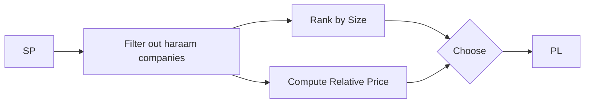
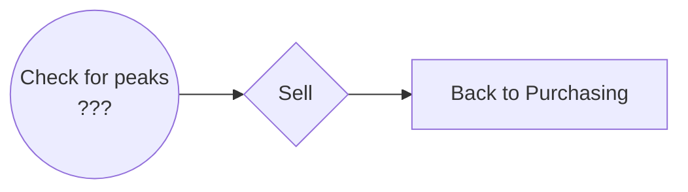
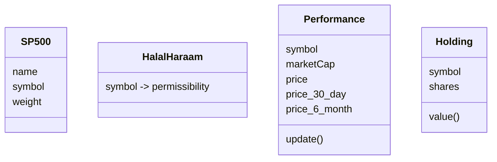

# Goals

Our goal is to invest our savings in a halal manner using stocks. 
When we say "stocks", we mean trading (i.e. buying and selling) shares of publicly traded companies on the stock market. 
The "stock market" we participate in is primarily the New York Stock Exchange (NYSE) and NASDAQ in the United States.

To accomplish this goal:
* We will use a process to determine if a company and its business are compliant with Islamic Shariah or if there are parts or all of their business that are haraam.
* Invest (i.e. buy) on a periodic basis, using a process to determine which "halal" stocks to purchases.
* Sell when it appears that the risk of a price decline is greater than a price increase or when there is a better opportunity.

# History

Success is making money (i.e. selling for more than we purchased in the aggregate) *and* at least keeping pace with the market. 
Keeping pace with the market or "market" returns is defined by the price appreciation of stock indices:

Dow Jones Industrial Average (DJIA)
: A price weighted index of 30 top public companies selected by Dow Jones. It's also known as "the Dow".

S&P 500
: A market capitilization weighted index of the top 500 US public companies (by market capitilization). It's also known as "the S&P".

NASDAQ
: A market capitilization weighted index of *ALL* of the companies listed on the NASDAQ exchange.

While there are many other indices, these three are the most popular for gauging the overall health of the market.
The Dow is popular for historical reasons.
The S&P is considered more accurate because it weights each company by its size. Therefore, price changes in larger companies have a larger impact than price increases in smaller companies.
The NASDAQ usually list more tech companies and therefore gives a better indication how the tech sector is performing. The performance of the tech sector can be a leading indicator for the rest of the economy as:
* Today's tech companies become tomorrow's industrial leaders.
* New technologies proliferate to 
  * other companies and industries and make them more profitable 
  * other new technologies and companies
  
Investors not concerned with whether their investments are halal typically invest in index funds that track one or more of these indices.
The market averages 7-10% returns annually with a lot of variance.
Obviously, many of the companies in these indices are in haraam sectors--banking, alcohol, entertainment, etc. 
Recently, Muslims are able to purchases Islamic mutual funds that also track these indices, but filter out companies engaged in haraam activities.
However, a major blind spot for most of the screens these funds use is to not screen out companies who derive a small percentage (<1% or <5%) of income from haraam activities.
The rationale is that some is unavoidable but not part of the main operation of the business. 
However, the size of some companies makes this rule problematic. For example has $400B in annual revenue (2024) and is considered halal.
Meanwhile, AMC has a little more than $4B in annual revenue (2024) and is considered haraam. 
Yet, Apple can engage in roughly $4B in its haraam music and movie business and is still considered halal. 

That is why we need our own process to screen companies and make market returns. 

# Overview

## Purchasing

We use the S&P 500 as our target index as it consists of the largest publicy traded companies in the US.
From there, we screen those companies to filter out those we consider haraam. 
Next, we decide which companies to purchase based on:
* largest market capitalization (i.e. size)
* lower relative price than other companies

We start with the largest companies as it may not be necessary to purchase every "halal" company to track the index.
Rather, a subset of the largest companies may give us a good blend of performance and diversity. 
We look for lower relative prices because it is good practice to space out purchases to avoid buying at a bad time (e.g. a relative market peak).
Since we are buying a part at a time, we may as well purchase those companies that are selling relatively cheaper. 
The risk here is that these may be companies on their way down and they relatively more expensive companies may be on their way up. 
To guard against that, we should compare the 30 day performance (relatively cheap/expensive lately) vs the 6 month or 12 month performance (long term trend).
Lastly, we try to maintain the same weight in our portfolio as in the S&P 500. 

In summary,

## Selling

Generally, we hold our shares and watch our investments grow!
However, there may be times when a specific company or the market in general looks like it is at a relative peak.
In these cases, it *may* make sense to sell one, more, or all of our companies.
If we do that, then we should continue to periodically purchase with the available cash. 

# Purchase Pipeline

## Data Objects

| Data | Memory | Persistence |
| --- | --- | --- |
| List of S&P 500 companies | List | CSV file |
| Halal/Haraam Identification | List | CSV file |
| Size and Performance | List | -- |
| Holdings | List | CSV file |

## Information Sources

### S&P 500 Membership

Many sites maintain a list of S&P 500 companies. 
We download it periodically and use it in our program.

### Permissibility

We determine the permissibility and keep it in a CSV file that the program loads. 